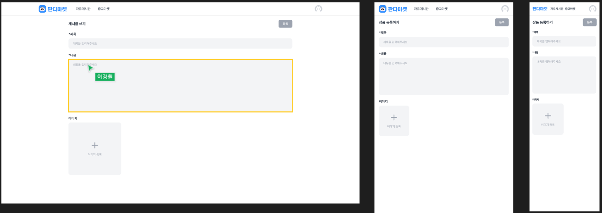
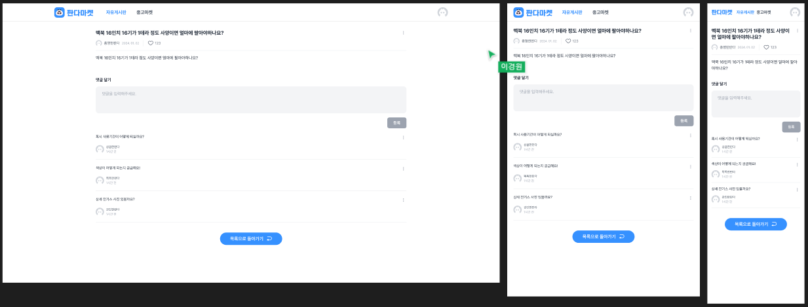
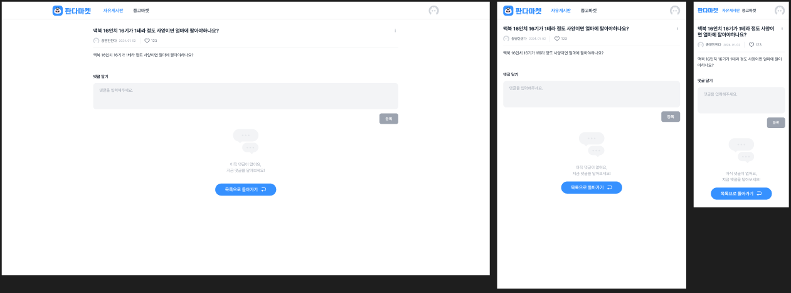

## Sprint 10

****
### 기본 사항
- 상품 등록 페이지 주소는  “/addboard” 입니다.
- 게시판 이미지는 최대 한개 업로드가 가능합니다.
- 각 input의 placeholder 값을 정확히 입력해주세요.
- 이미지를 제외하고 input 에 모든 값을 입력하면  ‘등록' 버튼이 활성화 됩니다.
- 회원가입, 로그인 api를 사용하여 받은accessToken을 사용하여 게시물 등록을 합니다.
- ‘등록’ 버튼을 누르면 게시물 상세 페이지로 이동합니다.
- 상품 상세 페이지 주소는  “/addboard/{id}” 입니다.
- 댓글 input 값을 입력하면  ‘등록' 버튼이 활성화 됩니다.
- 활성화된 ‘등록' 버튼을 누르면 댓글이 등록됩니다

### 심화

- 반응형으로 보여지는 베스트 게시판 개수를 다르게 설정할때 서버에 보내는 pageSize값을 적절하게 설정합니다.
- next의 prefetch 기능을 사용해봅니다.

### 백엔드 API 주소

https://panda-market-api.vercel.app/docs/#/

### 개인적으로 도전할 것

1. 기본 페이지 SSR로 수정
2. 상품 상세 페이지 SSR로 구현
3. react-hook-form 써보기